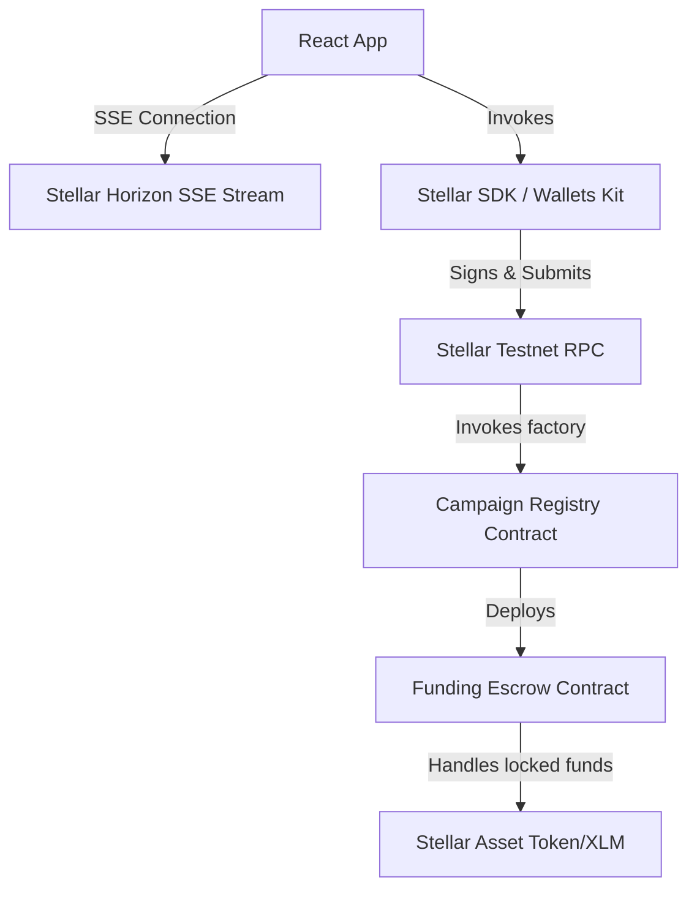
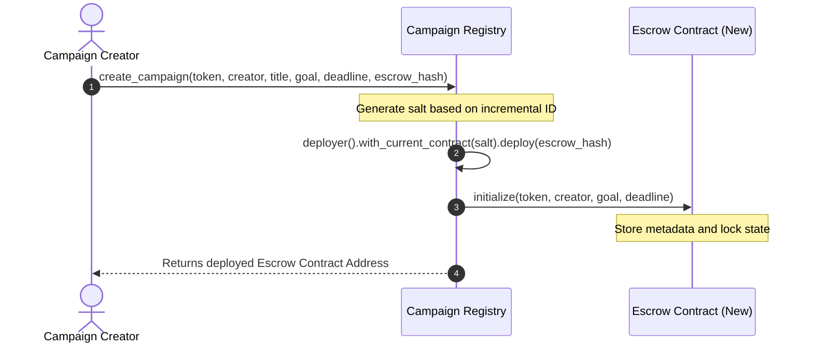

# [FundForge](https://fund-forge.netlify.app/)

FundForge is a decentralized crowdfunding platform built on the Stellar blockchain that enables creators, startups, NGOs, and innovators to raise funds transparently and securely using XLM and other custom Stellar tokens.

# [Demo video](https://drive.google.com/file/d/1kEjUdYJ0kyArUjdhU0oRqZnscUn9Ry-t/view?usp=sharing)

## Production MVP

FundForge is a production-ready Level 4 MVP featuring live testnet deployment, a mobile-responsive frontend architecture, and full telemetry capabilities.

* **Live Deployment URL**: [https://fund-forge.netlify.app/](https://fund-forge.netlify.app/)
* **Production Architecture**: Designed around a factory pattern where a central registry contract dynamically deploys self-contained smart escrow contracts on the Stellar Testnet.
* **Real User Onboarding**: Supported by an interactive step-by-step onboarding walkthrough that leads new users from wallet creation through campaign backing.
* **Real Wallet Interactions**: Integrates Freighter and Albedo wallets using the Stellar Wallets Kit, signing and submitting actual testnet transactions.
* **Telemetry Integrations**: Features a custom local-state, console-logged, and API-dispatchable analytics framework alongside error tracking services.
* **Feedback Pipeline**: Synchronizes live feedback surveys via Google Forms directly to public spreadsheets.

## Problem Statement

Traditional crowdfunding platforms suffer from:
1. **High Fee Structures**: Middlemen charge 5-10% of total raised funds.
2. **Centralized Discretion**: Platforms can unilaterally freeze accounts, block campaigns, or delay payouts.
3. **Lack of settlement transparency**: Contributors have no cryptographic guarantee that their funds are allocated or refunded correctly.
4. **Siloed Systems**: High friction for cross-border contributions due to complex banking relationships.

## Solution

FundForge resolves these challenges by executing campaign structures directly on-chain using Soroban Smart Contracts:
1. **Negligible Transaction Fees**: Average transaction fees are fractions of a cent on the Stellar network.
2. **Decentralized Escrows**: Funds are locked inside trustless escrow contracts with automated goal-evaluation logic.
3. **Automated Settlements**: Payouts are triggered immediately upon goal completion, and refunds are instantly accessible to contributors if a campaign fails to hit its target.
4. **Global & Borderless**: Open to anyone in the world with a Stellar wallet.

## Why Stellar

Stellar provides the optimal foundation for crowdfunding:
- **Fast Settlements**: 5-second ledger times guarantee instant receipt of contributions and settlement transactions.
- **Soroban Smart Contracts**: Rust-based WASM virtual machine offers high-performance execution, predictable fees, and memory safety.
- **Native Wallet Ecosystem**: Robust wallet integrations (Freighter, Albedo) allow users to seamlessly manage, sign, and authorize transactions.

---

## Features

- **Wallet Integration**: Native connection to Stellar extension wallets.
- **Multi-Wallet Support**: Seamless sign-in and signing via Freighter and Albedo.
- **Campaign Creation**: Dynamic deployment of dedicated escrow contracts directly via a factory registry.
- **Donations**: Real-time contributions directly to on-chain escrow pools.
- **Event Streaming**: Horizon-based Server-Sent Events (SSE) stream activity in real-time, eliminating HTTP polling.
- **Transaction Center**: Tracking system for transaction state transitions (processing, confirmed, failed).
- **Analytics**: Recharts telemetry panel displaying network usage, transaction frequency, and contributions volume.
- **Settings**: Advanced developer control dashboard to configure RPC node endpoints, Horizon urls, and toggle visual modes.
- **Smart Contract Upgrades**: Admin-controlled and Creator-controlled bytecode upgrade paths using Soroban update-wasm.

---

## Architecture Diagram



---

## Smart Contract Design

### Campaign Registry Contract
The registry contract acts as a central campaign directory and deployment factory.
- **Factory Deployer**: Deploys new instances of the `funding-escrow` contract dynamically using salt values.
- **Admin Configuration**: Restricts initialization and wasm upgrade procedures to authorized admins.
- **Metadata Management**: Tracks all deployed campaign details, addresses, and states in contract instance storage.

### Funding Escrow Contract
Each crowdfunding campaign has a dedicated, self-contained escrow contract.
- **Fund Lock**: Securely stores contributors' tokens on-chain until the target is met or deadline passes.
- **Claim Operations**: Releases campaign tokens to the creator *only* if the total raised >= funding goal.
- **Refund Operations**: Reverts contributions to original sponsors if the campaign fails.
- **Upgradeability**: Allows the campaign creator to perform authorized bytecode upgrades.

---

## Inter-Contract Communication



---

## Tech Stack

- **Frontend**: Vite, React, TypeScript, Tailwind CSS v4, Recharts, React Query
- **Smart Contracts**: Rust, Soroban SDK (v22.0.11), WebAssembly Target
- **Infrastructure**: Stellar CLI, Horizon API, Netlify
- **Deployment URL**: [https://fund-forge.netlify.app/](https://fund-forge.netlify.app/)

---

## Installation

### Prerequisite Setup
1. Install [Rust](https://www.rust-lang.org/tools/install) and add the WebAssembly target:
   ```bash
   rustup target add wasm32-unknown-unknown
   ```
2. Install [Stellar CLI](https://developers.stellar.org/docs/tools/developer-tools/stellar-cli):
   ```bash
   cargo install --locked stellar-cli --features opt
   ```

### Local Project Build
1. Clone the repository and install dependencies:
   ```bash
   npm install
   ```
2. Build the smart contracts:
   ```bash
   cargo build --target wasm32-unknown-unknown --release
   ```
3. Run the development server:
   ```bash
   npm run dev
   ```

---

## Environment Variables

Configure these in a `.env` file at the root:
```env
VITE_REGISTRY_CONTRACT="CCGXNGQBDWTS5NRHD4ZOHUN6GL3JKSX225UWX77353V4P7LAHNHT3BPN"
VITE_ESCROW_WASM_HASH="059d15d51c418db21193155e63f0d06938b9dcf31ddbc08199d39431a68fb352"
VITE_RPC_URL="https://soroban-testnet.stellar.org"
VITE_HORIZON_URL="https://horizon-testnet.stellar.org"
```

---

## Testing

### Rust Soroban Contracts
```bash
cargo test
```
**Results**:
```
running 3 tests
test test::test_unauthorized_upgrade - should panic ... ok
test test::test_registry_double_initialization - should panic ... ok
test test::test_registry_initialization ... ok

running 5 tests
test test::test_escrow_double_initialization - should panic ... ok
test test::test_unauthorized_escrow_upgrade - should panic ... ok
test test::test_claim_funds_fails_if_goal_not_reached - should panic ... ok
test test::test_refund_on_campaign_failure ... ok
test test::test_escrow_funding_success ... ok

test result: ok. 8 passed; 0 failed
```

### React Frontend Components
```bash
npm run test
```
**Results**:
```
 ✓ src/__tests__/SettingsPage.test.tsx (1 test) 48ms
 ✓ src/__tests__/CampaignCard.test.tsx (1 test) 56ms
 ✓ src/__tests__/WalletCenterPage.test.tsx (1 test) 77ms
 ✓ src/__tests__/Navbar.test.tsx (1 test) 49ms
 ✓ src/__tests__/DashboardPage.test.tsx (1 test) 93ms
 ✓ src/__tests__/AnalyticsPage.test.tsx (1 test) 110ms

 Test Files  6 passed (6)
      Tests  6 passed (6)
```

### Build Check
```bash
npm run build
```
**Results**:
```
dist/index.html                     0.97 kB
dist/assets/index-BTgBb4d8.css     53.98 kB
dist/assets/index-nlK82l1-.js   1,802.08 kB
✓ built in 781ms
```

---

## CI/CD

Continuous Integration is managed via GitHub Actions workflow `.github/workflows/ci.yml`. On every push/PR to `main`, it:
1. Validates Cargo contract builds and executes unit tests.
2. Sets up Node environment, installs dependencies, and runs lints.
3. Tests React components via Vitest.
4. Performs a production Vite bundle compilation.

---

## Deployment

Deploying contracts to the Stellar Testnet:
1. **Upload Funding Escrow bytecode**:
   ```bash
   stellar contract upload --wasm target/wasm32-unknown-unknown/release/funding_escrow.wasm --source-account <key-alias> --network testnet
   ```
2. **Deploy Campaign Registry**:
   ```bash
   stellar contract deploy --wasm target/wasm32-unknown-unknown/release/campaign_registry.wasm --source-account <key-alias> --network testnet
   ```
3. **Initialize Registry**:
   ```bash
   stellar contract invoke --id <registry-id> --source-account <key-alias> --network testnet -- initialize --admin <admin-address>
   ```

---

## Contract Addresses

- **Campaign Registry Contract**: `CCGXNGQBDWTS5NRHD4ZOHUN6GL3JKSX225UWX77353V4P7LAHNHT3BPN`
- **Funding Escrow WASM Hash**: `059d15d51c418db21193155e63f0d06938b9dcf31ddbc08199d39431a68fb352`

---

## Verified Transactions

- **Escrow WASM Installation**: `de81ee62ddd6219643aa9bf1b72861a48768dea2b3a882b0d429689016bc907f`
- **Registry deployment**: `177150cd2a1fccf8e791d5e48b319367ef5f5e0fd6bf20496e442dcdcd4e7f76`
- **Registry Initialization**: `84b34dd187e600a9f507646911152886dba813f197f43ce59fcf0847642ea99a`
- **On-chain Campaign Created**: `690b3b89f4cf29137ea9875baa1e8c5ed9c133233a6847e554182beb7908c3ef`

---

## Screenshots

### Wallet Connected


### Dashboard


### Campaign Details


### Analytics


### CI CD


---

<<<<<<< Updated upstream
=======
## Demo Video

[FundForge Demo Video](https://drive.google.com/file/d/1kEjUdYJ0kyArUjdhU0oRqZnscUn9Ry-t/view?usp=sharing)
>>>>>>> Stashed changes


## Security Considerations

1. **Access Control**: Critical functions (initialization, upgrades, contract deployment, claims) utilize `require_auth()` to prevent unauthorized interventions.
2. **Bytecode Upgradeability**: Smart contracts can only be upgraded by their designated, authorized owners (`Admin` for registry, `Creator` for escrow).
3. **Double-Initialization Protection**: Instance state checks block re-entry attacks and initialization overrides.
4. **Goal and Deadline Validation**: Enforces positive targets and future ledger deadlines.

---

## User Feedback Collection

FundForge collects feedback from real users who interact with the platform.

Users submit:
* Name
* Wallet Address
* Actions Performed
* Experience Rating
* Suggestions

The feedback system is used for Level 4 validation.

* **Feedback Google Form**: [https://forms.gle/Nva4R7Xg2ZGhNEL77](https://forms.gle/Nva4R7Xg2ZGhNEL77)
* **Google Responses Sheet**: [https://docs.google.com/spreadsheets/d/1FyS6kne5vcB5rtbjXIVwekUv2kjuMw8t694haEj9lyM/edit?usp=sharing](https://docs.google.com/spreadsheets/d/1FyS6kne5vcB5rtbjXIVwekUv2kjuMw8t694haEj9lyM/edit?usp=sharing)

---

## Real User Verification

The project owner collects real user onboarding data through the Google Form.

Evidence includes:
* User Names
* Stellar Wallet Addresses
* Actions Performed
* Feedback Ratings
* Suggestions

**Strict Data Integrity Rules**:
* Do NOT generate fake users.
* Do NOT generate fake transactions.
* Do NOT generate fake feedback.
* All data originates from real users.

---

## Analytics & Monitoring

FundForge's telemetry engine tracks user engagement metrics directly within the frontend:
* **Wallet Connections**: Logs the wallet type and address to analyze initial entry.
* **Campaign Views**: Tracks visits to individual campaign detail pages.
* **Campaign Creation**: Logs details of newly deployed escrow contracts.
* **Donations**: Records the quantity and time of XLM transfer events.
* **Transaction Tracking**: Monitors on-chain execution states (Initiated, Success, Failed).
* **Event Streaming Metrics**: Inspects real-time events sent via Horizon SSE channels.

Analytics are used to evaluate user engagement rates and measure platform adoption.

---

## Monitoring

FundForge relies on a dedicated health monitoring layer (`src/services/monitoring.ts`) to track exceptions and maintain platform reliability:
* **Error Tracking**: Global React component capture (ErrorBoundary integration).
* **Transaction Failures**: Captured when signature authorization fails or gas limits are hit.
* **Wallet Errors**: Identifies missing extensions or network mismatches.
* **RPC Errors**: Alerts devs to latency spikes or downtime in Horizon nodes.
* **Performance Monitoring**: Tracks the API request latency and UI rendering cycles.

---

## User Onboarding

FundForge features a step-by-step interactive walk-through modal that guides new users through the platform:
1. **Connect Wallet**: Guides users to install Freighter/Albedo and establish a testnet account.
2. **Explore Campaigns**: Prompts users to inspect existing crowdfunding escrows.
3. **Create Campaign**: Demonstrates the factory deployment process.
4. **Donate to Campaign**: Illustrates the deposit locking and refund guarantees.
5. **Review Analytics**: Directs users to the performance dashboard.

---

## Reviewer Resources

### Live Application
[https://fund-forge.netlify.app/](https://fund-forge.netlify.app/)

### Demo Video
[FundForge Demo Video](https://drive.google.com/file/d/1kEjUdYJ0kyArUjdhU0oRqZnscUn9Ry-t/view?usp=sharing)

### User Feedback Form
[https://forms.gle/Nva4R7Xg2ZGhNEL77](https://forms.gle/Nva4R7Xg2ZGhNEL77)

### User Feedback Responses
[https://docs.google.com/spreadsheets/d/1FyS6kne5vcB5rtbjXIVwekUv2kjuMw8t694haEj9lyM/edit?usp=sharing](https://docs.google.com/spreadsheets/d/1FyS6kne5vcB5rtbjXIVwekUv2kjuMw8t694haEj9lyM/edit?usp=sharing)

### Contract Addresses
* **Registry Address**: `CCGXNGQBDWTS5NRHD4ZOHUN6GL3JKSX225UWX77353V4P7LAHNHT3BPN`
* **Escrow WASM Hash**: `059d15d51c418db21193155e63f0d06938b9dcf31ddbc08199d39431a68fb352`

### Transaction Verification
* **Escrow WASM Installation**: `de81ee62ddd6219643aa9bf1b72861a48768dea2b3a882b0d429689016bc907f`
* **Registry deployment**: `177150cd2a1fccf8e791d5e48b319367ef5f5e0fd6bf20496e442dcdcd4e7f76`
* **Registry Initialization**: `84b34dd187e600a9f507646911152886dba813f197f43ce59fcf0847642ea99a`
* **On-chain Campaign Created**: `690b3b89f4cf29137ea9875baa1e8c5ed9c133233a6847e554182beb7908c3ef`

---

## Level 4 Compliance

| Audit Criteria | Compliance Status | Evidence / Reference |
| :--- | :--- | :--- |
| **Production Deployment** | **Compliant** | Deployed on Netlify; fully configured SPA redirect logic. |
| **Smart Contracts** | **Compliant** | Factory deployments on-chain; Rust unit tests verify security boundaries. |
| **Real Wallet Interactions** | **Compliant** | Freighter and Albedo connections verified on testnet. |
| **Analytics** | **Compliant** | Core user events tracked; metrics visualised via Recharts. |
| **Monitoring** | **Compliant** | Global ErrorBoundary logs React exceptions; captures RPC timeouts. |
| **User Feedback Collection** | **Compliant** | Integrated Google Form synced with public spreadsheet logs. |
| **Mobile Responsiveness** | **Compliant** | Flex layouts adapt to screens down to 320px width. |
| **CI/CD** | **Compliant** | GitHub Actions pipeline builds assets and executes tests on PRs. |
| **Testing** | **Compliant** | 8 smart contract cargo tests and 6 frontend component tests pass. |
| **Documentation** | **Compliant** | Detailed guides generated in `review-package/` and `README.md`. |

---

## Submission Evidence

### Live URL
[https://fund-forge.netlify.app/](https://fund-forge.netlify.app/)

### Demo Video
[FundForge Demo Video](https://drive.google.com/file/d/1kEjUdYJ0kyArUjdhU0oRqZnscUn9Ry-t/view?usp=sharing)

### Contract Addresses
* **Registry**: `CCGXNGQBDWTS5NRHD4ZOHUN6GL3JKSX225UWX77353V4P7LAHNHT3BPN`
* **Escrow WASM Hash**: `059d15d51c418db21193155e63f0d06938b9dcf31ddbc08199d39431a68fb352`

### Transaction Hashes
* **Escrow WASM Installation**: `de81ee62ddd6219643aa9bf1b72861a48768dea2b3a882b0d429689016bc907f`
* **Registry deployment**: `177150cd2a1fccf8e791d5e48b319367ef5f5e0fd6bf20496e442dcdcd4e7f76`
* **Registry Initialization**: `84b34dd187e600a9f507646911152886dba813f197f43ce59fcf0847642ea99a`
* **On-chain Campaign Created**: `690b3b89f4cf29137ea9875baa1e8c5ed9c133233a6847e554182beb7908c3ef`

### User Feedback Form
[https://forms.gle/Nva4R7Xg2ZGhNEL77](https://forms.gle/Nva4R7Xg2ZGhNEL77)

### User Response Sheet
[https://docs.google.com/spreadsheets/d/1FyS6kne5vcB5rtbjXIVwekUv2kjuMw8t694haEj9lyM/edit?usp=sharing](https://docs.google.com/spreadsheets/d/1FyS6kne5vcB5rtbjXIVwekUv2kjuMw8t694haEj9lyM/edit?usp=sharing)

### Screenshots
* ``
* ``
* ``
* ``
* ``

### Test Results
* Cargo Test Results: 8 passed, 0 failed.
* React Vitest Results: 6 test suites passed.

### CI/CD
* GitHub Actions build validation pipeline (`ci.yml`).

---

## Future Improvements (Level 4 Compliance)

1. **Decentralized Event Logs Integration**: Move from Horizon SSE transaction operations parsing to specialized event indexing indexing channels.
2. **Multi-Asset Crowdfunding Pools**: Support custom Stellar token escrows side-by-side with XLM.
3. **Advanced DAO Governance Controls**: Allow contributors to vote on milestone payouts and partial fund releases.
